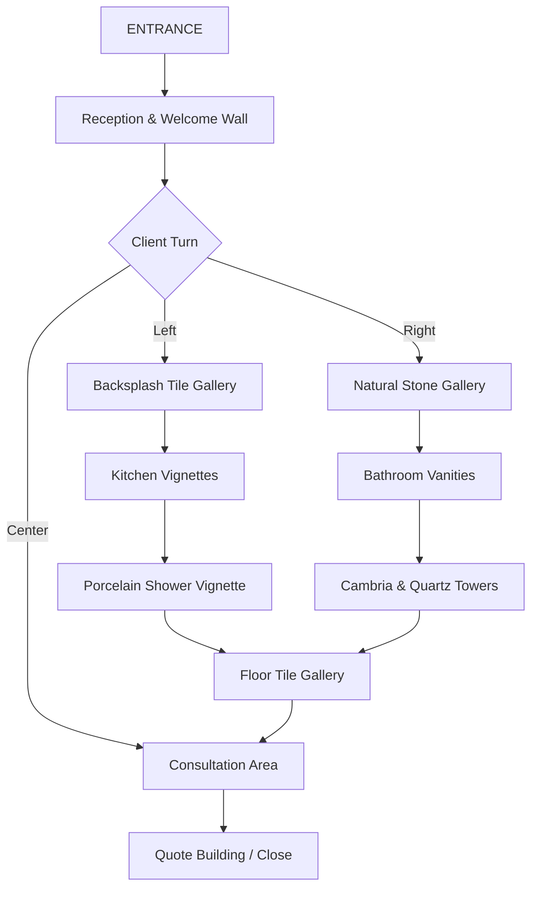

# AGS Showroom Design Plan — 50' × 40' (2,000 sqft)

> **Last Updated:** 2026-05-15
> **Status:** Draft — Awaiting Owner Review
> **Related:** [AGS_STRATEGIC_PLAN.md](file:///c:/ibrahim/AGS/AGS_STRATEGIC_PLAN.md) → Pillar 4 (Smart Showroom Expansion)

---

## Conceptual Floor Plan


---

## Design Philosophy

This showroom is NOT a retail store. It's a **B2B selling environment** — a place where:
- **GCs bring their clients** to make material selections in a premium indoor setting
- **K&B store partners bring designers** to finalize specs
- **AGS closes higher-margin jobs** through an immersive material experience

Every zone is designed to **complement B2B partner offerings**, not compete with them. The showroom is positioned as an **"Extension of Your Showroom"** — a shared resource that makes partners more successful.

---

## Zone Layout (8 Zones)

### Zone Map Overview

```
┌──────────────────────────────────────────────────────┐
│                    50 FEET WIDE                      │
│                                                      │
│  ┌──────────┐   ┌──────────────┐   ┌──────────────┐ │
│  │          │   │              │   │   CAMBRIA &   │ │
│  │ PORCELAIN│   │  FLOOR TILE  │   │    QUARTZ     │ │
│  │ SHOWER   │   │   GALLERY    │   │   DISPLAY     │ │
│  │ VIGNETTE │   │              │   │   TOWERS      │ │
│  │          │   │              │   │              │ │  40
│  └──────────┘   └──────────────┘   └──────────────┘ │  FEET
│                                                      │  DEEP
│  ┌──────────────────┐   ┌────────────────────────┐  │
│  │                  │   │                        │  │
│  │  KITCHEN         │   │  BATHROOM VANITY       │  │
│  │  VIGNETTES       │   │  DISPLAYS              │  │
│  │  (2 layouts)     │   │  (2 vanities)          │  │
│  │                  │   │                        │  │
│  └──────────────────┘   └────────────────────────┘  │
│                                                      │
│  ┌──────────┐   ┌──────────────┐   ┌──────────────┐ │
│  │BACKSPLASH│   │ CONSULTATION │   │  NATURAL     │ │
│  │  TILE    │   │    AREA      │   │  STONE       │ │
│  │ GALLERY  │   │  (table +    │   │  GALLERY     │ │
│  │ (wall)   │   │   samples)   │   │  (wall)      │ │
│  └──────────┘   └──────────────┘   └──────────────┘ │
│                                                      │
│              ┌──────────────────┐                    │
│              │    ENTRANCE &    │                    │
│              │   RECEPTION DESK │                    │
│              └──────────────────┘                    │
└──────────────────────────────────────────────────────┘
```

---

## Zone Details

### Zone 1: Entrance & Reception (Front Center)
**Dimensions:** ~12' × 8'

| Element | Details |
|---|---|
| **Reception desk** | Clean white quartz countertop on white shaker base — doubles as product demo |
| **Welcome wall** | AGS branding, 20-year legacy signage, partner logos (Harkins, CCS — with permission) |
| **Digital display** | 55" screen cycling project photos, Pro Portal demo, testimonials |
| **Purpose** | First impression. Premium, clean, professional. NOT cluttered. |

**B2B Positioning:** Partners walk in and immediately see a polished operation, not a warehouse.

---

### Zone 2: Backsplash Tile Gallery (Front Left Wall)
**Dimensions:** ~12' × 8' (wall-mounted displays)

| Element | Details |
|---|---|
| **Display format** | Vertical panel boards — 12"×12" tile samples mounted on branded display boards |
| **Categories** | Ceramic, porcelain, glass mosaic, natural stone mosaic, patterned/designer tiles |
| **Sample count** | 80–120 backsplash samples (mix of styles, colors, price points) |
| **Organization** | Grouped by material type → sub-grouped by color family |
| **Pricing** | Per-sqft price tag on each sample for quick quoting |

> [!IMPORTANT]
> **Channel Conflict Risk: LOW.** Backsplash tiles are a **complementary add-on** to countertop jobs. K&B stores may carry some tile, but AGS positioning is: "We help your client pick the backsplash that complements the stone they just selected." This **adds value** to the partner relationship, not competes with it.

**Revenue Play:** Backsplash upsell on every countertop job. Target: **$800–$2,500 incremental revenue per project.**

---

### Zone 3: Natural Stone Gallery (Front Right Wall)
**Dimensions:** ~12' × 8' (wall-mounted + angled slab racks)

| Element | Details |
|---|---|
| **Display format** | Wall-mounted stone slabs (half-slabs or remnants) angled at 70° for visibility |
| **Materials** | Marble, travertine, slate, quartzite, onyx — premium natural stones |
| **Sample count** | 20–30 slabs (curated selection — not a slab yard, this is the "gallery") |
| **Lighting** | Dedicated LED downlights to showcase veining and movement |
| **Purpose** | This is NOT competing with the main slab yard — this is the curated "museum" of premium options |

> [!NOTE]
> This zone displays **specialty/premium natural stone** that differentiates from the everyday granite/quartz in the slab yard. Think: book-matched marble, exotic quartzite, backlit onyx. These are "wow" materials that close high-margin jobs.

---

### Zone 4: Kitchen Vignettes (Center Left)
**Dimensions:** ~16' × 12'

This is the **anchor zone** — the most impactful selling area in the showroom.

| Vignette | Layout | Details |
|---|---|---|
| **Vignette A** | L-shaped kitchen + island | White shaker cabinets, quartz countertops, backsplash tile, undermount sink, faucet. Full kitchen feel. |
| **Vignette B** | Galley/straight run kitchen | White shaker cabinets, natural stone countertop, different backsplash style. Shows contrast to Vignette A. |

**Key Design Decisions:**
- **Cabinets:** White shaker only. AGS does NOT sell cabinets — these are **display props** to create realistic vignettes. Make this clear with small signage: *"Cabinets shown for display purposes. Countertop and tile selections available through AGS."*
- **Countertops:** Rotate materials quarterly. Always showcase at least one Cambria product and one natural stone.
- **Backsplash:** Installed backsplash behind each kitchen to show tile in context (not just as a sample board).
- **Edge profiles:** Display different edge profiles on each vignette to show the options.
- **Sink/Faucet:** Basic undermount sink with standard faucet. NOT the selling point, but necessary for realism.

> [!TIP]
> **The Upsell Engine:** When a GC brings a homeowner here to pick a countertop, the homeowner sees the tile, the edge profile, the full kitchen context — and they want the whole package. Average ticket goes UP because they're buying with their eyes, not from a sample chip.

---

### Zone 5: Bathroom Vanity Displays (Center Right)
**Dimensions:** ~14' × 10'

| Vanity | Layout | Details |
|---|---|---|
| **Vanity A** | 60" double vanity | White shaker cabinet, marble or quartz top, two undermount sinks, wall mirror, backsplash behind |
| **Vanity B** | 36" single vanity | White shaker cabinet, quartz or granite top, vessel sink option, different backsplash |

**Key Points:**
- Same principle as kitchens — cabinets are display props, countertops and tile are the product.
- Shows partners and their clients what a finished bathroom feels like with AGS materials.
- Backsplash tile on the vanity walls connects Zone 2 (backsplash gallery) to a real application.

---

### Zone 6: Porcelain Shower Vignette (Back Left Corner)
**Dimensions:** ~10' × 10'

**This is the showstopper zone.**

| Element | Details |
|---|---|
| **Structure** | Full walk-in shower enclosure — 3 walls + glass panel (no door needed for display) |
| **Wall material** | Large-format porcelain panels (e.g., 48"×96" or 60"×120") — simulating marble or stone |
| **Floor** | Porcelain tile shower floor with linear drain detail |
| **Niche** | Built-in shower niche with contrasting tile |
| **Bench** | Optional corner bench with porcelain or natural stone cap |
| **Lighting** | Recessed LED in shower ceiling for dramatic effect |
| **Plumbing** | Display-only showerhead and valve trim (no actual water connection needed) |

> [!IMPORTANT]
> **Channel Conflict Risk: LOW-MEDIUM.** Large-format porcelain panels for showers are still a **specialty product** most K&B stores don't actively sell. AGS can position this as: "We offer porcelain shower fabrication and installation as a **complement** to the countertop work you're already sending us." This expands wallet share without stepping on partners' core business.

**Revenue Play:** Porcelain shower projects are **$5,000–$15,000+** per job. This is a high-margin add-on that most competitors in AGS's market don't offer.

---

### Zone 7: Cambria & Quartz Display Towers (Back Right Corner)
**Dimensions:** ~12' × 10'

| Element | Details |
|---|---|
| **Cambria towers** | 2 branded Cambria rotating display towers (Cambria provides these to authorized dealers) |
| **Other quartz towers** | 2–3 additional display towers for other quartz brands (Caesarstone, Silestone, MSI, Vicostone, etc.) |
| **Display format** | Each tower holds 20–40 sample doors showing colors/patterns |
| **Lighting** | Overhead spots per tower for accurate color rendering |
| **Branding** | Cambria gets premium placement (dedicated branded area if partnership is formalized) |

#### Cambria Partnership Strategy

> [!IMPORTANT]
> **Cambria Partnership — Key Considerations:**
>
> **Why Cambria:**
> - Premium brand recognition — customers ask for it by name
> - Cambria provides **marketing support, display towers, and co-branded materials** to authorized fabricators
> - Lifetime warranty (Cambria offers) gives AGS a selling tool
> - Higher margin per sqft vs. commodity quartz
>
> **Partnership Requirements (Typical):**
> - Must be an authorized Cambria fabricator
> - Minimum annual purchase volume (discuss with Cambria rep)
> - Showroom display commitment (towers + dedicated space)
> - Must follow Cambria's fabrication standards
>
> **Action Items:**
> - [ ] Contact Cambria regional sales rep to discuss dealer/fabricator partnership
> - [ ] Request display tower program details (Cambria often provides towers at no cost to qualified dealers)
> - [ ] Negotiate co-marketing support (Cambria sometimes funds local advertising for partners)
> - [ ] Confirm AGS's fabrication capabilities meet Cambria's quality standards

---

### Zone 8: Floor Tile Gallery (Back Center)
**Dimensions:** ~14' × 10'

| Element | Details |
|---|---|
| **Display format** | Large tile samples (18"×18" or 24"×24") displayed on angled floor racks or flat on elevated platforms |
| **Categories** | Porcelain floor tile, natural stone floor tile, large-format porcelain (for floors and walls) |
| **Sample count** | 40–60 floor tile options |
| **Organization** | By material → by look (wood-look, marble-look, concrete-look, natural stone) |
| **Floor display area** | A 6'×6' section of the floor itself tiled in a featured product — so visitors literally walk on it |

> [!NOTE]
> **Channel Conflict Risk: MEDIUM.** K&B stores and flooring stores sell floor tile. However, AGS can position this as: "We carry floor tile for **project coordination** — your client picks their countertop and floor tile in one visit, and we handle the full material package." The emphasis is on convenience and project bundling, NOT on being a tile store.

---

## Central Consultation Area
**Dimensions:** ~10' × 8' (center of showroom)

| Element | Details |
|---|---|
| **Table** | 48"×72" white quartz consultation table (custom-made — another product demo) |
| **Seating** | 4–6 modern chairs |
| **Samples** | Portable sample bins for bringing tiles/stone to the table |
| **Tech** | Tablet or laptop for Pro Portal demo, quote building |
| **Purpose** | Where the sale happens. GC + homeowner sit down, review selections, build the quote |

---

## Channel Conflict Summary Matrix

| Product Zone | Conflict Risk | Mitigation Strategy |
|---|---|---|
| Backsplash Tile | 🟢 LOW | Complementary add-on; "helps your client complete the look" |
| Natural Stone (Premium) | 🟢 LOW | Specialty/exotic stones not typically stocked by K&B stores |
| Kitchen Vignettes | 🟢 LOW | Cabinets are display-only; countertops are core AGS business |
| Bathroom Vanities | 🟢 LOW | Same as kitchen — cabinets are props, surfaces are the product |
| Porcelain Shower | 🟡 LOW-MED | Specialty fabrication; most partners don't offer this |
| Cambria / Quartz | 🟢 LOW | Core AGS business; partners already send clients for quartz |
| Floor Tile | 🟡 MEDIUM | Position as "project coordination," not a tile store |
| Display Towers (Other Quartz) | 🟢 LOW | Sample display for material selection, not retail |

> [!TIP]
> **Net Assessment:** No zone presents a HIGH conflict risk. The biggest risk area (floor tile) can be managed by positioning it as a convenience/coordination play, not a competitive move. The overall showroom **strengthens** B2B partner relationships by giving them a premium space to bring their clients.

---

## Traffic Flow Design



**Flow Logic:** Visitors enter → see the premium welcome → are guided through material categories in context (installed in kitchens, bathrooms, showers) → end at the consultation table where selections become a quote.

---

## Estimated Buildout Budget (Rough Order of Magnitude)

| Category | Estimated Cost | Notes |
|---|---|---|
| **White shaker cabinets** (kitchen + vanity) | $4,000 – $6,000 | RTA/wholesale cabinets for display only |
| **Countertop fabrication** (vignettes + reception) | $2,000 – $4,000 | Internal cost (AGS labor + material at cost) |
| **Porcelain shower build-out** | $5,000 – $8,000 | Framing, porcelain panels, glass panel, trim, lighting |
| **Tile display fixtures** (backsplash + floor) | $3,000 – $5,000 | Panel boards, display racks, angled stands |
| **Slab display racks** (natural stone wall) | $2,000 – $3,000 | Metal A-frame or wall-mount racks |
| **Display towers** (Cambria + other quartz) | $0 – $2,000 | Cambria often provides for free; others may charge |
| **Lighting** (LED tracks, spots, shower) | $2,000 – $4,000 | Critical — proper lighting sells stone |
| **Consultation table + seating** | $1,500 – $3,000 | Quartz top table (internal fabrication) |
| **Signage, branding, digital display** | $1,500 – $3,000 | TV screen, wall graphics, zone labels |
| **Flooring** (showroom floor) | $2,000 – $4,000 | Feature tile area + general flooring |
| **Plumbing trim** (display sinks/faucets) | $500 – $1,000 | Non-functional display only |
| **Paint, drywall, finishing** | $1,500 – $3,000 | Walls, ceiling, general finishing |
| | | |
| **TOTAL ESTIMATE** | **$25,000 – $46,000** | |

> [!WARNING]
> These are rough estimates. Get actual quotes from cabinet suppliers, electricians (lighting), and any needed framing/drywall contractors. Many costs can be reduced by using AGS's own labor for countertop fabrication, tile installation, and general construction.

---

## Phased Rollout (If Budget Is Tight)

| Phase | Zones | Why First | Est. Cost |
|---|---|---|---|
| **Phase 1** | Kitchen Vignettes + Backsplash + Consultation Area | Highest impact — this is where most revenue is generated | $10K–$16K |
| **Phase 2** | Cambria/Quartz Towers + Natural Stone Wall | Formalizes the material selection experience + Cambria partnership | $4K–$7K |
| **Phase 3** | Porcelain Shower + Bathroom Vanities | Adds high-margin new revenue channel | $7K–$12K |
| **Phase 4** | Floor Tile Gallery + Final Finishing | Completes the full-service material package | $4K–$8K |

---

## Open Questions for Owner Decision

1. **Cambria:** Are you already in discussions with a Cambria rep, or is this a cold outreach? This determines timeline for Zone 7.
2. **Other quartz brands:** Which brands do you currently fabricate most? We should prioritize those for display towers.
3. **Cabinet quantity:** How many kitchen layouts do you want? Two is the recommendation, but three might work if we tighten the vanity area.
4. **Wet connection for shower:** Do we want to actually plumb the shower with water (dramatic demo capability) or keep it dry/display-only? Water adds cost and maintenance.
5. **Budget ceiling:** Is there a hard budget number we need to stay under? The phased approach lets us start at ~$10K.
6. **Timeline:** When is the space available to build out? Any lease considerations?
7. **Floor tile depth:** How much do you want to invest in floor tile? This is the highest-conflict zone — we could start with a smaller curated selection and expand based on demand.

---

## How This Ties to AGS Strategy

| Strategic Pillar | Showroom Impact |
|---|---|
| **Pillar 2 (B2B Outbound)** | "Come see our new showroom" is the #1 outbound hook for K&B stores and designers |
| **Pillar 4 (Showroom Expansion)** | This IS Pillar 4. Direct execution. |
| **Pillar 5 (Pro Portal)** | Consultation area includes Pro Portal demo — partners can build quotes on-site |
| **Revenue Growth** | Backsplash upsells ($800–$2,500/job) + porcelain showers ($5K–$15K/job) = significant incremental revenue |
| **Partner Retention** | "Extension of Your Showroom" positioning strengthens — not threatens — partner relationships |
